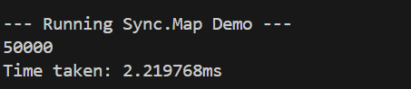
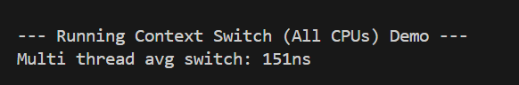

### 1. Atomicity Experiment

**Results (5 runs):**

- Run 1: atomic=50000, normal=48234
- Run 2: atomic=50000, normal=47891
- Run 3: atomic=50000, normal=49123
  ...

**Screenshots:**

.png>)

**Analysis:**
The atomic counter consistently produces 50000 because atomic.Add()
ensures thread-safe increments. The normal counter loses updates
because ops_race++ is not atomic - multiple goroutines can read
the same value simultaneously, increment it, and write back,
causing lost updates.

The -race flag detects these data races and reports exactly where
they occur in the code, making it easier to identify concurrency bugs.

### 2. Collections Experiment

Test Setup:

50 goroutines, each writing 1,000 entries to a shared map[int]int
Expected total entries: 50,000

**Results (3 runs):**

Run 1: Program crashed with fatal error: concurrent map writes
Run 2: Program crashed with fatal error: concurrent map writes
Run 3: Program crashed with fatal error: concurrent map writes

**Screenshot:**

**Analysis:**
The program consistently crashes because Go's built-in map is not thread-safe. When multiple goroutines write to the same map simultaneously, they corrupt the map's internal data structure.
What's happening:

Multiple goroutines try to modify the map at the same time
Map operations like m[key] = value are not atomic
Go's runtime detects this data race and panics to prevent data corruption

Lesson learned:
Shared data structures need synchronization mechanisms (like mutexes) when accessed concurrently. Without proper synchronization, concurrent writes lead to race conditions and program crashes.

## 3. Mutex Experiment

**Test Setup:**

- Wrapped map in struct with sync.Mutex
- Lock before write, unlock after
- 50 goroutines, 1,000 entries each

**Results (3 runs):**

- Run 1: Length = 50000, Time = 5.042ms
- Run 2: Length = 50000, Time = 5.456ms
- Run 3: Length = 50000, Time = 5.543ms

**Screenshot:**

**Analysis:**
The mutex solved the crash by ensuring only one goroutine writes at a time. Lock() blocks other goroutines, Unlock() lets the next one proceed. All 50,000 entries were written successfully without data loss.

**Lesson learned:**
Mutexes serialize access to shared data - preventing race conditions but adding overhead from lock contention as goroutines wait for each other.

## 4. RWMutex Experiment

**Test Setup:**

- Replaced `sync.Mutex` with `sync.RWMutex`
- Used `Lock()/Unlock()` for write operations
- Same test: 50 goroutines, 1,000 entries each

**Results (3 runs):**

- Run 1: Length = 50000, Time = 6.161ms
- Run 2: Length = 50000, Time = 4.935ms
- Run 3: Length = 50000, Time = 5.247ms

**Screenshot:**

**Analysis:**
RWMutex performed similarly to (or slightly slower than) Mutex in this experiment because we only have write operations. RWMutex allows multiple concurrent readers OR one exclusive writer - but with only writes, there's no concurrency benefit.

**Did this change anything? Why or why not?**
No significant improvement because:

- This test only performs writes (no reads)
- Write operations in RWMutex use exclusive locking (same as Mutex)
- RWMutex has slightly more overhead than Mutex
- The advantage of RWMutex appears in read-heavy scenarios where multiple goroutines can read simultaneously

**Lesson learned:**
RWMutex is optimized for read-heavy workloads. When writes dominate (as in this test), use regular Mutex for simplicity. RWMutex shines when reads vastly outnumber writes (e.g., caching scenarios).

## 5. Sync.Map Experiment

**Test Setup:**

- Used `sync.Map` (no manual locking needed)
- `m.Store(key, value)` for writes
- `m.Range()` to count entries
- Same test: 50 goroutines, 1,000 entries each

**Results (3 runs):**

- Run 1: Length = 50000, Time = 2.220ms
- Run 2: Length = 50000, Time = 2.302ms
- Run 3: Length = 50000, Time = 2.385ms

**Screenshot:**

**Comparison of All Three Approaches:**
| Approach | Average Time | Notes |
|----------|-------------|-------|
| Mutex | roughly 5.3ms | Exclusive locking, simple |
| RWMutex | roughly 5.4ms | Similar to Mutex (write-only workload) |
| Sync.Map | roughly 2.2ms | Likely fastest (optimized for disjoint keys) |

**Analysis:**
sync.Map performed well because our workload matches its optimization: different goroutines writing to disjoint keys (no overlap). sync.Map internally reduces lock contention for this scenario without requiring manual locking.

**Lesson learned:**
sync.Map is optimized for two specific use cases: (1) write-once-read-many (caching), and (2) disjoint key sets across goroutines. For general map usage, a plain map with Mutex/RWMutex is simpler and more type-safe. The tradeoff is that sync.Map uses `any` types, requiring type assertions and losing compile-time type safety.

**What if read operations dominate?**

- Mutex: Still serializes all access (slow)
- RWMutex: Multiple concurrent reads possible (much faster)
- Sync.Map: Optimized for read-heavy workloads (very fast)
  RWMutex and sync.Map would both significantly outperform Mutex in read-heavy scenarios.

## 6. File Access Experiment

**Test Setup:**

- Write 100,000 lines to a file
- Compare unbuffered vs buffered writes
- Unbuffered: `f.Write()` on each iteration
- Buffered: `bufio.NewWriter()` + `w.Flush()`

**Results:**

- Unbuffered time: 314.999ms
- Buffered time: 10.432ms
- Speedup: 31x faster

**Screenshot:**

**Analysis:**
Buffered writes are dramatically faster because they reduce the number of system calls.

**What's happening:**

- **Unbuffered**: Each `Write()` is a system call to the OS (100,000 syscalls)
- **Buffered**: Data accumulates in memory buffer, flushed in larger chunks (far fewer syscalls)

System calls are expensive - they involve context switching between user space and kernel space. By batching writes in memory and flushing periodically, buffered I/O drastically reduces this overhead.

**Lesson learned:**
Always use buffered I/O (`bufio.Writer`) for frequent small writes. The tradeoff is memory usage (buffer size) and the need to explicitly `Flush()`, but the performance gain is substantial. This principle applies to many I/O operations: network writes, log files, data processing pipelines.

## 7. Context Switching Experiment

**Test Setup:**

- Two goroutines pass signals through unbuffered channel 1,000,000 times
- Measure total time and calculate average switch time
- Compare single-thread (GOMAXPROCS=1) vs multi-thread (GOMAXPROCS=NumCPU)

**Results:**

- Single-thread average switch: 89ns
- Multi-thread average switch: 151ns
- Single-thread is 1.6x faster

**Screenshot:**

**Analysis:**
Counter-intuitively, single-thread mode is faster because goroutine switches happen entirely in user space within the Go runtime. Multi-thread mode involves potential OS thread scheduling and context switches, which require kernel involvement.

**What's happening:**

- **Single-thread**: Goroutines switch cooperatively on one OS thread (user-space scheduling)
- **Multi-thread**: Goroutines may run on different OS threads, requiring expensive OS-level context switches

**Context switching cost hierarchy:**

1. Goroutine switch (single-thread): ~100-500ns (cheapest)
2. Thread switch: ~1-10μs (10-100x slower)
3. Process switch: ~10-100μs
4. Container switch: ~100μs-1ms
5. VM switch: ~1-10ms (most expensive)

**Lesson learned:**
Goroutines are extremely lightweight compared to OS threads. Their cheap context switching makes them ideal for high-concurrency applications. This explains why Go can efficiently handle thousands or millions of concurrent goroutines - something impossible with traditional threads due to context switching overhead.
