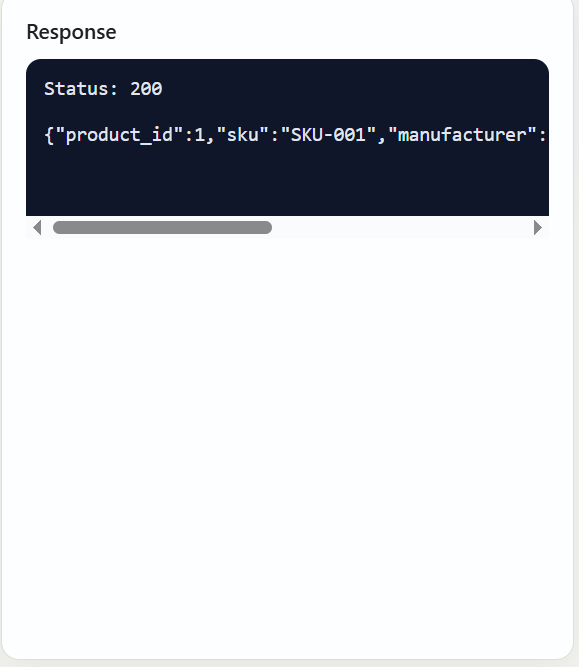
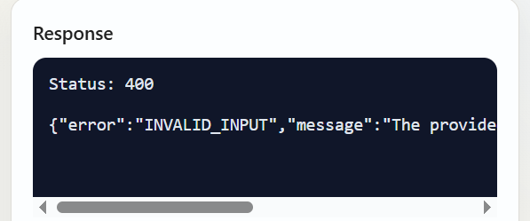
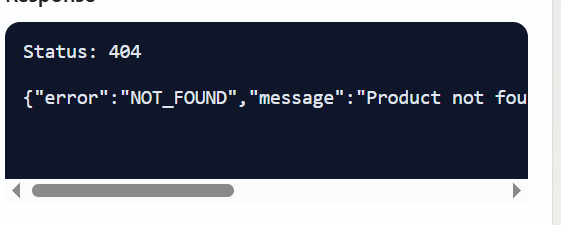

# CS6650 Assignment 5 (fork from 2b) — Product API with Terraform & Load Testing

## Project Structure

```
.
├── src/
│   ├── main.go          # Go server — Product API implementation
│   └── go.mod           # Go module definition
├── Dockerfile            # Multi-stage Docker build (Alpine-based, ~25MB)
├── terraform/            # Infrastructure as Code for AWS ECS/ECR
│   ├── provider.tf
│   ├── variables.tf
│   ├── main.tf
│   ├── output.tf
│   └── modules/
│       ├── ecr/
│       ├── ecs/
│       ├── logging/
│       └── network/
├── locustfile.py         # Locust load testing script
├── locust_reports/       # Locust HTML test reports
├── screenshots/          # All screenshots for this assignment
└── README.md
```

---

## Part II: Product API

### API Endpoints (based on OpenAPI spec)

| Method | Endpoint                        | Description                | Status Codes       |
| ------ | ------------------------------- | -------------------------- | ------------------ |
| GET    | `/products/{productId}`         | Get product by ID          | 200, 404, 500      |
| POST   | `/products/{productId}/details` | Add/update product details | 204, 400, 404, 500 |

### Product Schema (all fields required)

| Field         | Type   | Constraints |
| ------------- | ------ | ----------- |
| product_id    | int32  | ≥ 1         |
| sku           | string | 1–100 chars |
| manufacturer  | string | 1–200 chars |
| category_id   | int32  | ≥ 1         |
| weight        | int32  | ≥ 0         |
| some_other_id | int32  | ≥ 1         |

### How to Run Locally

```bash
cd src
go mod tidy
go run main.go
# Server starts on http://localhost:5173
```

### How to Run with Docker

```bash
docker build -t product-api .
docker run -p 5173:5173 product-api
```

Docker image size: **~24.71 MB** (multi-stage Alpine build)


### Response Code Examples

#### ✅ 204 — Product Details Added Successfully (POST)

```bash
curl -i -X POST http://localhost:5173/products/1/details \
  -H "Content-Type: application/json" \
  -d '{
    "product_id": 1,
    "sku": "SKU-001",
    "manufacturer": "Acme",
    "category_id": 10,
    "weight": 5,
    "some_other_id": 99
  }'
# HTTP/1.1 204 No Content
```


#### ✅ 200 — Product Found (GET)

```bash
curl http://localhost:5173/products/1
# 200 OK + product JSON
```




#### ❌ 400 — Invalid Input

```bash
# Missing required field (empty sku)
curl -X POST http://localhost:5173/products/1/details \
  -H "Content-Type: application/json" \
  -d '{"product_id":1,"sku":"","manufacturer":"Acme","category_id":1,"weight":100,"some_other_id":1}'
```



#### ❌ 404 — Product Not Found

```bash
curl http://localhost:5173/products/9999
# OR: POST body product_id doesn't match path
curl -X POST http://localhost:5173/products/1/details \
  -H "Content-Type: application/json" \
  -d '{"product_id":999,"sku":"SKU","manufacturer":"Acme","category_id":1,"weight":1,"some_other_id":1}'
```


#### ❌ 500 — Internal Server Error

The server includes a panic recovery middleware. If any unexpected panic occurs during request processing, the server catches it and returns a 500 JSON response instead of crashing.



### Data Storage

Products are stored **in-memory** using a Go `map[int]*Product` protected by `sync.RWMutex` for thread-safe concurrent read/write access. Data does not persist across server restarts.

---

## Part III: Terraform Deployment to AWS (ECS/ECR)

### How to Deploy

1. **Configure AWS credentials:**

   ```bash
   aws configure
   ```

2. **Initialize Terraform:**

   ```bash
   cd terraform
   terraform init -upgrade
   ```

   

3. **Deploy infrastructure:**

   ```bash
   terraform apply
   ```

4. **Get the public IP:**

   ```bash
   # From ECS task network interface
   aws ec2 describe-network-interfaces \
     --network-interface-ids $eniId \
     --query "NetworkInterfaces[0].Association.PublicIp" \
     --output text
   ```

   

5. **Test on AWS:**

   ```bash
   # POST
   curl -i -X POST http://<PUBLIC_IP>:5173/products/1/details \
     -H "Content-Type: application/json" \
     -d '{"product_id":1,"sku":"SKU-1001","manufacturer":"Acme","category_id":10,"weight":5,"some_other_id":123}'

   # GET
   curl -i http://<PUBLIC_IP>:5173/products/1
   ```

   
   

6. **Tear down:**
   ```bash
   terraform destroy
   ```

---

## Part IV: Load Testing with Locust

### Test Script Design

The `locustfile.py` includes **both HttpUser and FastHttpUser** for comparison. Key design decisions:

- **GET:POST = 3:1 ratio** — simulates real-world e-commerce where reads are far more common than writes
- **`on_start` pre-populates 50 products** — ensures GET requests don't 404, giving meaningful performance data
- **`wait_time = between(1, 3)`** — realistic think time between requests

### How to Run

```bash
pip install locust

# Test locally
locust -f locustfile.py --host=http://localhost:5173

# Test on AWS
locust -f locustfile.py --host=http://<PUBLIC_IP>:5173
```

Open `http://localhost:8089` to configure users and spawn rate.

### Test Results Summary

| Environment | Users | Spawn Rate | Total Requests | Failures | Avg RT (ms) | RPS   | Duration |
| ----------- | ----- | ---------- | -------------- | -------- | ----------- | ----- | -------- |
| **Local**   | 10    | 2          | 1,337          | 0 (0%)   | 1.1         | 8.0   | 2m 47s   |
| **Local**   | 100   | 10         | 24,468         | 0 (0%)   | 2.1         | 62.0  | 6m 35s   |
| **Local**   | 500   | 50         | 142,191        | 0 (0%)   | 25.8        | 295.3 | 8m 1s    |
| **AWS**     | 10    | 2          | 1,592          | 0 (0%)   | 13.4        | 7.1   | 3m 43s   |
| **AWS**     | 100   | 10         | 18,248         | 0 (0%)   | 12.9        | 67.1  | 4m 33s   |
| **AWS**     | 500   | 50         | 89,546         | 0 (0%)   | 38.7        | 332.0 | 4m 30s   |

> Detailed Locust HTML reports are available in the `locust_reports/` directory.

### Key Observations

1. **Zero failure rate across all tests** — the Go server handled all load levels without errors.

2. **Local vs AWS latency:** Local tests show ~1ms average response time at low load, while AWS adds ~12ms of network latency overhead. This is expected due to the round-trip between the test client and the AWS Fargate instance.

3. **Scaling behavior:** As users increase from 10 → 100 → 500, average response time grows gradually (1.1ms → 2.1ms → 25.8ms locally), showing the server degrades gracefully under load rather than failing abruptly.

4. **RPS scales well:** RPS increased roughly proportionally with users (8 → 62 → 295 locally), indicating the server is not bottlenecked at these levels.

### HttpUser vs FastHttpUser

In our tests, **we did not observe a significant difference** between HttpUser and FastHttpUser. Reasons:

- **The bottleneck is the server, not the client.** Our Go server responds in ~1ms locally. At this speed, both HTTP clients can keep up easily. FastHttpUser's advantage (using `geventhttpclient` instead of Python's `requests` library) only becomes visible when the client itself is the bottleneck — typically at very high concurrency (1000+ users) or on resource-constrained machines.

- **Network latency dominates.** When testing against AWS, the ~12ms network round-trip far outweighs any client-side overhead difference between the two implementations.

- **When FastHttpUser shines:** It becomes meaningful when generating extremely high RPS from a single Locust worker, or when response times are sub-millisecond and client overhead becomes a significant portion of total time.

### Which operations are most common in real-world?

In a real e-commerce system, **reads (GET) vastly outnumber writes (POST)**. Customers browse products far more often than products are created or updated. This is why our test uses a 3:1 GET:POST ratio.

This has implications for data structure choice: a `sync.RWMutex`-protected hashmap is ideal because it allows **concurrent reads** (multiple goroutines can read simultaneously) while only blocking for writes. For a read-heavy workload, this provides much better throughput than a regular `sync.Mutex` which would serialize all access.

---

## Discussion Questions

### How would you design a scalable backend for the full API?

The complete `api.yaml` defines four services: Products, Shopping Cart, Warehouse, and Payments. A scalable design would use:

1. **Microservices architecture** — separate each service into its own deployable unit, allowing independent scaling. The Product service handles high read traffic and can be scaled horizontally, while the Payment service needs fewer instances but higher reliability.

2. **Database per service** — Products: read-replica PostgreSQL; Shopping Cart: Redis for fast session-based access; Warehouse: PostgreSQL with strong consistency; Payments: ACID-compliant database.

3. **Message queue for async operations** — Checkout triggers inventory reservation and payment processing asynchronously via a message broker (e.g., SQS, Kafka), decoupling services and improving resilience.

4. **API Gateway** — single entry point for routing, rate limiting, and authentication (the spec includes API key and JWT auth).

5. **Caching layer** — Redis/Memcached in front of the Product service for frequently accessed data.

### What does "Terraform is a declarative language" mean?

**Declarative** means you describe _what_ the desired end state should be, not _how_ to get there. You write "I want an ECS cluster with this task definition" — Terraform figures out the steps.

**Imperative** languages (like shell scripts) require you to specify every step: "first create the VPC, then the subnet, then the security group..." — and you must handle ordering and error recovery yourself.

Terraform's declarative approach helps because it automatically handles dependency ordering, detects drift from desired state, and can preview changes before applying (`terraform plan`), making infrastructure management safer and reproducible.

---

## .gitignore

```
# Terraform
.terraform/
*.tfstate
*.tfstate.backup
*.tfvars
.terraform.lock.hcl

# Environment
.env

# OS
.DS_Store

# Binary
server
```
