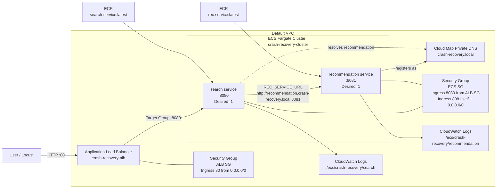

# Crash-Recovery Terraform Topology

```mermaid
flowchart LR
    U[User / Locust] -->|HTTP :80| ALB[Application Load Balancer<br/>crash-recovery-alb]

    subgraph VPC[Default VPC]
      subgraph ECS[ECS Fargate Cluster<br/>crash-recovery-cluster]
        SVC1[search service<br/>:8080<br/>Desired=1]
        SVC2[recommendation service<br/>:8081<br/>Desired=1]
      end

      ALB -->|Target Group :8080| SVC1
      SVC1 -->|REC_SERVICE_URL<br/>http://recommendation.crash-recovery.local:8081| SVC2

      SD[Cloud Map Private DNS<br/>crash-recovery.local]
      SVC2 -.registers as.-> SD
      SVC1 -.resolves recommendation.-> SD

      SG1[Security Group<br/>ALB SG<br/>Ingress 80 from 0.0.0.0/0]
      SG2[Security Group<br/>ECS SG<br/>Ingress 8080 from ALB SG<br/>Ingress 8081 self + 0.0.0.0/0]

      ALB --- SG1
      SVC1 --- SG2
      SVC2 --- SG2

      LOG1[CloudWatch Logs<br/>/ecs/crash-recovery/search]
      LOG2[CloudWatch Logs<br/>/ecs/crash-recovery/recommendation]
      SVC1 --> LOG1
      SVC2 --> LOG2
    end

    ECR1[ECR<br/>search-service:latest] --> SVC1
    ECR2[ECR<br/>rec-service:latest] --> SVC2
```
